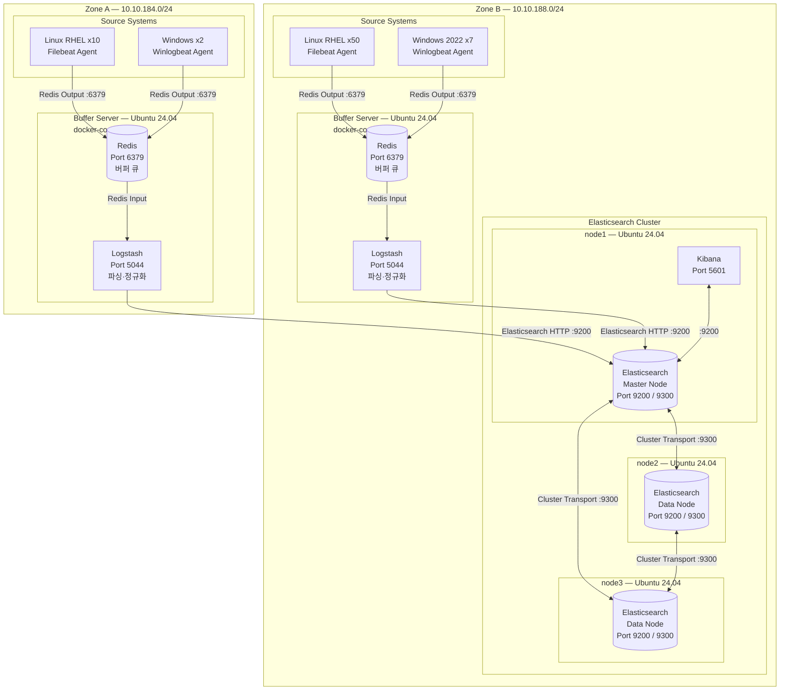
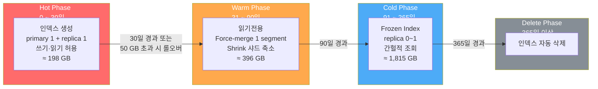

# LogServer — ELK 스택 로그 수집 시스템

> 운영 서버 69대의 시스템·보안·인증 로그를 수집하고 1년간 안정적으로 저장하기 위한  
> ELK 스택 기반 중앙화 로그 관리 시스템

---

## 목차

1. [시스템 개요](#1-시스템-개요)
2. [아키텍처 설계](#2-아키텍처-설계)
3. [서버 스펙](#3-서버-스펙)
4. [기술 스택](#4-기술-스택)
5. [ILM 정책](#5-ilm-정책)
6. [모노레포 구조](#6-모노레포-구조)
7. [배포 가이드](#7-배포-가이드)

---

## 1. 시스템 개요

### 수집 대상

| Zone | 서버 종류 | 대수 | IP 대역 |
|------|-----------|------|---------|
| ZoneA | Linux (RHEL) | 10대 | 10.10.184.0/24 |
| ZoneA | Windows | 2대 | 10.10.184.0/24 |
| ZoneB | Linux (RHEL) | 50대 | 10.10.188.0/24 |
| ZoneB | Windows 2022 | 7대 | 10.10.188.0/24 |
| **합계** | | **69대** | |

### 수집 로그 종류

- **시스템 로그** : `/var/log/messages`, `/var/log/syslog`, Windows System Event Log
- **보안 로그** : `/var/log/audit/audit.log`, Windows Security Event Log
- **인증 로그** : `/var/log/secure`, `/var/log/auth.log`

### 저장 기간

**1년 (365일)** — ILM 4단계 정책으로 자동 관리

---

## 2. 아키텍처 설계

### 전체 흐름

```
Source (Filebeat / Winlogbeat)
  → Redis (버퍼 큐, 유실 방지)
    → Logstash (파싱·필터링·정규화)
      → Elasticsearch Master (인덱싱)
        → Data Node1 / Node2 (샤드 분산 저장)
```

### 구성도



### 설계 포인트

| 항목 | 설명 |
|------|------|
| **Redis 버퍼** | 로그 스파이크 흡수 및 Logstash 장애 시 유실 방지 |
| **Zone 분리** | ZoneA·B 각각 독립 버퍼 서버 → Zone 간 트래픽 최소화 |
| **ES 역할 분리** | Master(node1)는 클러스터 상태 관리 전담, Data(node2·3)는 저장 담당 |
| **TLS 전구간 암호화** | Beats → Redis → Logstash → ES 전 구간 TLS 적용 |
| **Beats Agent** | Linux: Filebeat / Windows: Winlogbeat |

---

## 3. 서버 스펙

### 로그 발생량 추정

| 구분 | 대수 | 서버당/일 | 소계/일 |
|------|------|-----------|---------|
| Linux RHEL (ZoneA+B) | 60대 | 80 MB | 4,800 MB |
| Windows (ZoneA+B) | 9대 | 200 MB | 1,800 MB |
| **원본 합계** | **69대** | | **≈ 6.6 GB/일** |
| ES 저장량 (압축 50% + 레플리카 1) | | | **≈ 6.6 GB/일** |
| **연간 총 저장량** | | | **≈ 2.4 TB** |

### 서버별 스펙

#### Buffer 서버 (ZoneA · ZoneB 각 1대)

| 항목 | 스펙 |
|------|------|
| OS | Ubuntu 24.04.2 LTS |
| CPU | 8 core |
| RAM | 16 GB (Redis 4 GB + Logstash 8 GB + OS 4 GB) |
| SSD | 300 GB (OS 50 GB + Logstash PQ 50 GB + Redis AOF 10 GB + 여유) |
| 컨테이너 | Redis + Logstash (docker-compose) |

#### es-node1 (Elasticsearch Master + Kibana)

| 항목 | 스펙 |
|------|------|
| OS | Ubuntu 24.04.2 LTS |
| CPU | 8 core |
| RAM | 32 GB (ES JVM 8 GB + Kibana 4 GB + OS 나머지) |
| SSD | 500 GB (마스터 상태·로그 전용, 데이터 저장 없음) |
| 컨테이너 | Elasticsearch Master + Kibana (docker-compose) |

#### es-node2 · es-node3 (Elasticsearch Data Node × 2)

| 항목 | 스펙 |
|------|------|
| OS | Ubuntu 24.04.2 LTS |
| CPU | 16 core |
| RAM | 64 GB (ES JVM 32 GB + OS Page Cache 32 GB) |
| NVMe SSD | 500 GB (Hot · Warm 티어) |
| HDD | 2 TB (Cold 티어) |
| 네트워크 | 10 Gbps (클러스터 내부 통신) |
| 컨테이너 | Elasticsearch Data (docker-compose) |

> **ES JVM Heap 32 GB 한계** : Compressed OOPs(Object Ordinary Pointers) 적용 상한선.  
> 32 GB 초과 시 메모리 주소 효율이 급격히 저하되므로 초과 설정 금지.

### 전체 서버 요약

| 서버 | Zone | CPU | RAM | SSD | HDD | 역할 |
|------|------|-----|-----|-----|-----|------|
| Buffer-A | A | 8c | 16 GB | 300 GB | - | Redis + Logstash |
| Buffer-B | B | 8c | 16 GB | 300 GB | - | Redis + Logstash |
| node1 | B | 8c | 32 GB | 500 GB | - | ES Master + Kibana |
| node2 | B | 16c | 64 GB | 500 GB | 2 TB | ES Data |
| node3 | B | 16c | 64 GB | 500 GB | 2 TB | ES Data |

---

## 4. 기술 스택

> **선정 기준** : 최신 버전(9.x) 제외, 6개월 이상 운영 검증된 안정화 버전 사용

### 버전 목록

| 컴포넌트 | 버전 | 출시 | 선택 근거 |
|----------|------|------|-----------|
| **Elasticsearch** | **8.17.4** | 2024.12 | 8.x 성숙 라인 마지막 안정 버전, 9.x 전환 전 검증 완료 |
| **Logstash** | **8.17.4** | 2024.12 | ES와 동일 버전 필수 |
| **Kibana** | **8.17.4** | 2024.12 | ES와 동일 버전 필수 |
| **Filebeat** | **8.17.4** | 2024.12 | ES major 버전 일치 |
| **Winlogbeat** | **8.17.4** | 2024.12 | ES major 버전 일치 |
| **Redis** | **7.4.x** | 2024.07 | 7.2.x EOL(2026.02) 전 교체, 7.4.x 안정 라인 |
| **Docker Engine** | **27.x** | 2024.06 | 6개월+ 검증, Ubuntu 24.04 완전 지원 |
| **Docker Compose** | **v2.29.x** | 2024.09 | v2 기준 안정, Compose v5 spec 전 버전 |
| **Ubuntu** | **24.04.2 LTS** | 2024.08 | LTS 포인트 릴리즈, 2036년까지 지원 |

### 호환성 매트릭스

| 조합 | 호환 | 비고 |
|------|------|------|
| ES 8.17.x + Kibana 8.17.x | ✅ | 동일 버전 권장 |
| ES 8.17.x + Logstash 8.17.x | ✅ | 동일 버전 권장 |
| ES 8.17.x + Filebeat/Winlogbeat 8.17.x | ✅ | 동일 major·minor |
| Redis 7.4.x + logstash-input-redis | ✅ | Redis 2.6+ 호환 |
| Docker Engine 27.x + Ubuntu 24.04 | ✅ | 완전 지원 |
| ES 8.x + Kibana 9.x | ❌ | major 버전 혼용 불가 |

### EOL 일정

| 컴포넌트 | 버전 | 지원 종료 |
|----------|------|----------|
| Elasticsearch 8.17.x | 8.17 | 2026.12 예정 |
| Redis 7.4.x | 7.4 | 2026.07 예정 |
| Ubuntu 24.04 LTS | Noble | **2036.04** |

### ES 8.x 주요 설정 사항

```yaml
# Security 기본 활성화 (8.x 이후 기본값)
xpack.security.enabled: true
xpack.security.http.ssl.enabled: true
xpack.security.transport.ssl.enabled: true
```

- Logstash → Elasticsearch 간 HTTPS 통신 필수
- 초기 구성 시 `elasticsearch-certutil` 로 CA·노드 인증서 발급 필요
- JVM은 ES 번들 JDK 사용 (`JAVA_HOME` 별도 지정 금지)

---

## 5. ILM 정책

### 4단계 수명주기



### 단계별 설정 요약

| 단계 | 기간 | 용량 | 주요 액션 |
|------|------|------|-----------|
| Hot | 0 ~ 30일 | 198 GB | rollover (30d / 50gb), priority=100 |
| Warm | 31 ~ 90일 | 396 GB | force_merge(1), shrink(1), readonly, priority=50 |
| Cold | 91 ~ 365일 | 1,815 GB | freeze, priority=0 |
| Delete | 365일+ | - | delete |

### 인덱스 카테고리

| 인덱스 별칭 | 수집 로그 |
|-------------|-----------|
| `logs-syslog` | Linux 시스템 로그 |
| `logs-auth` | Linux 인증 로그 |
| `logs-audit` | Linux 감사 로그 |
| `logs-windows_system` | Windows 시스템 이벤트 |
| `logs-windows_security` | Windows 보안 이벤트 |

---

## 6. 모노레포 구조

pnpm workspace 기반 모노레포로 5대의 ELK 서버 설정과 2종의 에이전트 설정을 통합 관리합니다.

```
LogServer/
├── package.json                          ← 루트 (전체 명령 진입점)
├── pnpm-workspace.yaml
├── .npmrc
├── .env.example                          ← 전체 IP·버전 환경변수 템플릿
│
├── packages/
│   ├── buffer-a/                         ← ZoneA: Redis + Logstash
│   │   ├── docker-compose.yml
│   │   ├── .env.example
│   │   ├── logstash/
│   │   │   ├── config/logstash.yml       ← workers=4, PQ=4gb
│   │   │   └── pipeline/logstash.conf   ← syslog·auth·audit·windows 파싱
│   │   └── redis/redis.conf
│   │
│   ├── buffer-b/                         ← ZoneB: Redis + Logstash (workers=8, PQ=8gb)
│   │   └── (buffer-a 와 동일 구조)
│   │
│   ├── es-node1/                         ← Elasticsearch Master + Kibana
│   │   ├── docker-compose.yml
│   │   ├── elasticsearch/config/elasticsearch.yml   ← roles: [master]
│   │   └── kibana/config/kibana.yml
│   │
│   ├── es-node2/                         ← Elasticsearch Data Node
│   │   ├── docker-compose.yml
│   │   └── elasticsearch/config/elasticsearch.yml   ← roles: [data_hot, data_warm, data_cold ...]
│   │
│   ├── es-node3/                         ← Elasticsearch Data Node (node2 와 동일)
│   │
│   ├── agent-linux/                      ← Filebeat for RHEL
│   │   ├── filebeat.yml                  ← Redis output 설정
│   │   ├── modules.d/system.yml
│   │   ├── modules.d/auditd.yml
│   │   └── install.sh                   ← dnf install + systemd 자동 등록
│   │
│   ├── agent-windows/                   ← Winlogbeat for Windows 2022
│   │   ├── winlogbeat.yml               ← 보안 Event ID 필터링 포함
│   │   └── install.ps1                  ← PowerShell 자동 설치 스크립트
│   │
│   └── shared/                          ← 공통 리소스 (모든 패키지가 참조)
│       ├── certs/generate-certs.sh      ← elasticsearch-certutil 래퍼
│       ├── ilm/policy.json              ← ILM 4단계 정책 정의
│       ├── index-templates/logs-template.json
│       └── scripts/setup-es.sh         ← ILM·템플릿 ES 일괄 적용
│
└── scripts/
    ├── deploy.sh                         ← 전체 순서 배포 자동화
    └── health-check.mjs                 ← 클러스터·Redis 헬스체크
```

---

## 7. 배포 가이드

### 사전 준비

```bash
# 1. 저장소 클론 후 환경변수 설정
cp .env.example .env
# .env 파일에서 IP, 패스워드 등 실제 값으로 수정

# 각 패키지별 .env 파일도 동일하게 설정
cp packages/es-node1/.env.example packages/es-node1/.env
cp packages/es-node2/.env.example packages/es-node2/.env
cp packages/es-node3/.env.example packages/es-node3/.env
cp packages/buffer-a/.env.example packages/buffer-a/.env
cp packages/buffer-b/.env.example packages/buffer-b/.env

# 2. pnpm 설치 (없는 경우)
npm install -g pnpm@9
```

### 배포 순서

```bash
# Step 1. TLS 인증서 생성
pnpm --filter shared run gen-certs

# Step 2. Elasticsearch node1 (Master + Kibana) 먼저 기동
pnpm run up:node1
# 30초 대기 후 node2, node3 기동

# Step 3. Data 노드 기동
pnpm run up:node2
pnpm run up:node3

# Step 4. ILM 정책 + 인덱스 템플릿 적용
pnpm run setup

# Step 5. Buffer 서버 기동
pnpm run up:buffer-b
pnpm run up:buffer-a

# 또는 전체 자동 배포
bash scripts/deploy.sh
```

### 에이전트 배포

```bash
# Linux (RHEL) — 대상 서버에서 실행
cd packages/agent-linux
REDIS_HOST=10.10.184.100 REDIS_PASSWORD=yourpass ZONE=ZoneA bash install.sh

# Windows 2022 — 관리자 PowerShell에서 실행
cd packages\agent-windows
.\install.ps1 -RedisHost 10.10.188.100 -RedisPassword yourpass -Zone ZoneB
```

### 자주 쓰는 명령어

| 명령 | 동작 |
|------|------|
| `pnpm run up:all` | 전체 서비스 기동 |
| `pnpm run down:all` | 전체 서비스 중단 |
| `pnpm run ps:all` | 전체 컨테이너 상태 확인 |
| `pnpm run health` | 클러스터 + Redis 헬스체크 |
| `pnpm --filter es-node1 run logs:kibana` | Kibana 로그 확인 |
| `pnpm --filter buffer-b run logs:logstash` | Logstash 로그 확인 |
| `pnpm --filter shared run apply-ilm` | ILM 정책 재적용 |

### Kibana 접속

```
URL      : http://10.10.188.10:5601
계정      : elastic
패스워드  : .env 파일의 ELASTIC_PASSWORD 값
```
